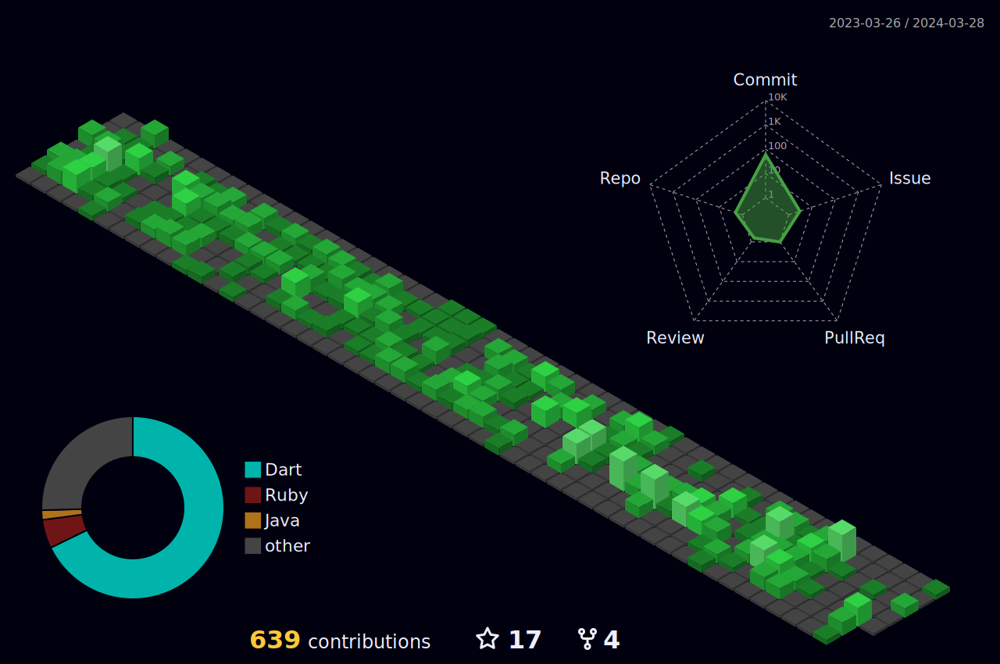

# Hi there, welcome to my profile 👋

#### I'm Chris, a software developer creating mobile apps, working remotely

- 🔭 currently working at [Netguru](https://www.netguru.com) on various different projects
- 🎓 on my way to get master degree in software engineering
- 🌱 learning about mobile tech, better ways to manage time
- 🥏 lifting weights, running, and hitting trails consistently
- ⚡ Fun fact: I love [F1](https://f1tv.formula1.com/) (and Max V.), [Assassin's
Creed](https://www.ubisoft.com/en-gb/game/assassins-creed)
- 💬 Ask me about [Flutter](https://flutter.dev), [Notion](https://www.notion.so)

<h3 align="left">Languages and Tools:</h3>

 
            

    
Dart Packages

    
    
    
    
    
    
    
    
    
    
    
    
    
    
    
    
    
    
    
    
     
    <i>Sidenote: Packages related directly to UI are not listed here.</i>

<h3 align="left">Connect with me:</h3>

    

<h3 align="left">Streaks:</h3>

<h3 align="left">Stats:</h3>

    
3D Contributions

    

 

    
don't click

     
    Hey, told you not to click! I apologize for this guy sleeping in my readme. I don't want to wake him up, so just
    stashed him here 😅
     
     
    

